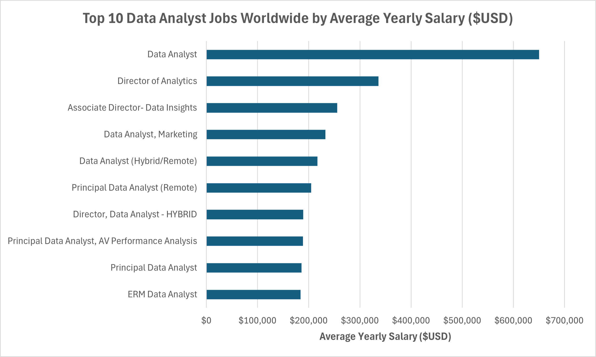
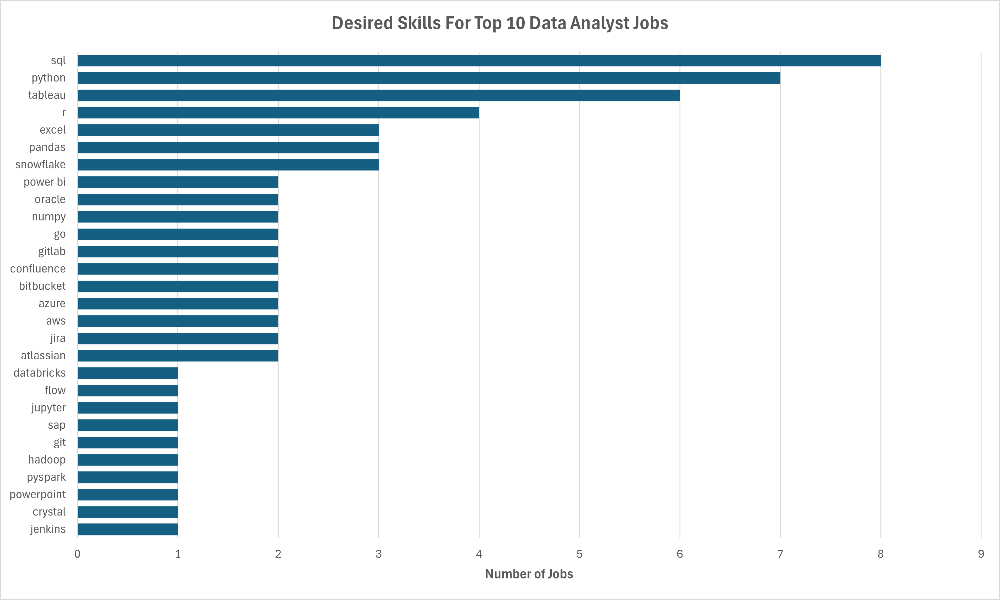
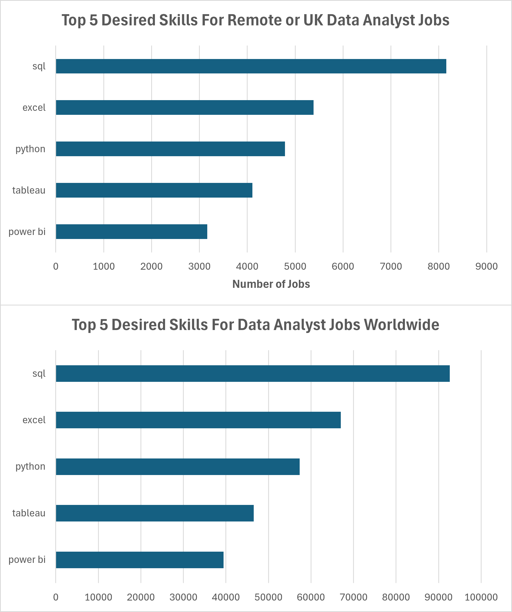
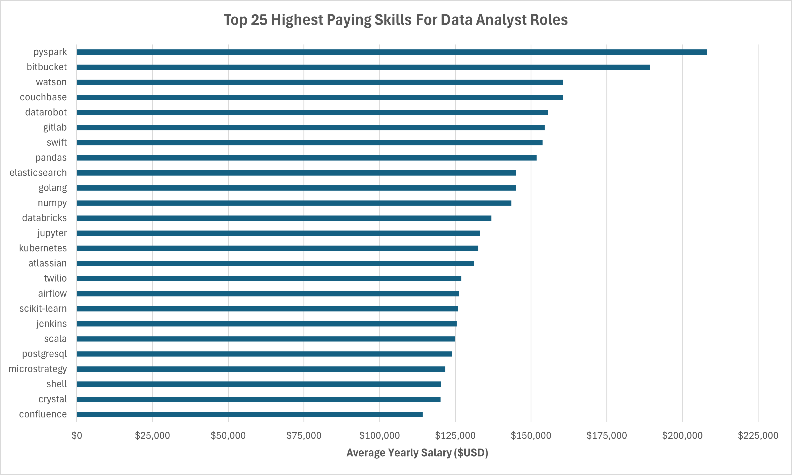
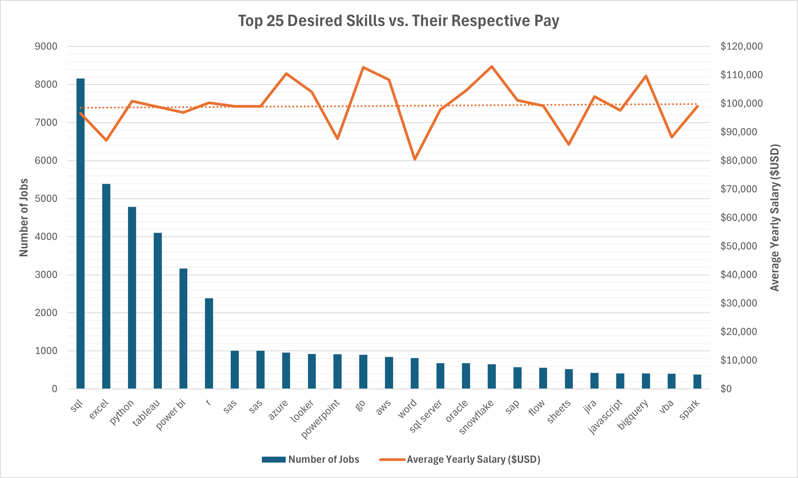

# Introduction

A dive into the data science job market using data scraped from multiple job postings sites in 2023. This project was used as a tool to practice SQL querying with a focus on exploring in-demand skills, top paying jobs, and other variables, mostly for data analyst roles.

For all SQL queries, check them out here: [project_sql folder](/project_sql/). You can also check some other practice queries here: [practice_problems.sql](/practice_problems.sql).

# Background

In an effort to improve my skills with SQL using relevant real-world data, this project was undertaken to navigate the data analyst job market more effectively and drive insight into figuring out the best path to take and skills to learn for a career in data anayltics, streamlining an efficient route in the market.

Data comes from [Luke Barousse's SQL Course](https://lukebarousse.com/sql), filled with insights on job titles, salaries, locations, essential skills, and more. The course was used as a guideline, prompting questions to be answered independently and then checking up on work with an established field professional.

# Tools Used

- **SQL** - the bread and butter of the analyses, allowing quick querying of the database and uncovering key points of interest and insights into the data
- **PostgreSQL** - the chosen database management system for the project
- **Visual Studio Code** - my go-to IDE for anything programming related, including the database management and execution of SQL queries in this project
- **Git & GitHub** - essential for version control and sharing of my work
- **Excel** - used for the output of queries and some quick graph visualisations of the resulting data

# Analysis

Each query in this project investigated specific aspects of the data analyst job market looking for key points of interest in desired skills, or similarities amongst top paying jobs:

### 1. Top Paying Data Anaylst Jobs

This query indentified the top 10 data analyst positions by highest yearly salary, specifically filtered by remote or UK based roles.

```sql
SELECT
    job_id,
    job_title,
    company_dim.name AS company_name,
    job_location,
    job_schedule_type,
    salary_year_avg,
    job_posted_date :: DATE
FROM
    job_postings_fact
    LEFT JOIN company_dim ON company_dim.company_id = job_postings_fact.company_id
WHERE
    job_title_short = 'Data Analyst'
    AND (
        job_work_from_home = TRUE
        OR job_location = 'Anywhere' -- Use OR to cover bases
        OR job_location = 'United Kingdom'
    )
    AND salary_year_avg IS NOT NULL
ORDER BY
    salary_year_avg DESC
LIMIT
    10
```

This simple query returned some interesting results indicating:

- Top end positions settle at around $200,000, suggesting significant earning potential in the field
- One job offers a full-time position at $650,000, most likely an outlier in the data, with the full job title simply being "Data Analyst" whereas most others in this list are "Director" or "Principal" roles


_Bar graph visualising the average yearly salary for the top 10 data analyst roles worldwide_

### 2. Desired Skills For Top Paying Jobs

To provide more insight into the skills required for a top-end position, I used the previous query as a CTE and joined the skills details data to find out how many of the top 10 jobs shared common skills.

```sql
WITH top_jobs AS (
    SELECT
        job_id,
        job_title,
        company_dim.name AS company_name,
        salary_year_avg
    FROM
        job_postings_fact
        LEFT JOIN company_dim ON company_dim.company_id = job_postings_fact.company_id
    WHERE
        job_title_short = 'Data Analyst'
        AND (
            job_work_from_home = TRUE
            OR job_location = 'Anywhere' -- Use OR to cover bases
            OR job_location = 'United Kingdom'
        )
        AND salary_year_avg IS NOT NULL
    ORDER BY
        salary_year_avg DESC
    LIMIT
        10
)
SELECT
    skills AS skill_name,
    COUNT(top_jobs.job_id) AS jobs_count
FROM
    top_jobs
    INNER JOIN skills_job_dim ON skills_job_dim.job_id = top_jobs.job_id
    INNER JOIN skills_dim ON skills_dim.skill_id = skills_job_dim.skill_id
GROUP BY
    skill_name
ORDER BY
    jobs_count DESC
```

- SQL lead the way with 80% of the jobs desiring this skill - indicating an essential presence amongst high-earning positions
- Python and Tableau follow closely behind with the majority of jobs desiring these skills, suggesting generalist languages and tools don't lose favour out to specialised libraries or other skills even further into a data analyst career
- A number of skills only have one or two job postings in the top 10, showing each role most likely provides a unique experience using different tools and skills


_A graph to show all listed skills desired for the top 10 highest paying data analyst jobs and how many of those jobs want each one_

### 3. Most Desired Skills For Data Analyst Roles

This query helped to identify the most commonly desired skills for data analyst job postings both for my area of interest (remote or UK-based) and worldwide, to see if there were any differences and provide insight into what skills to learn that could be widely applied to many roles.

```sql
SELECT
    skills AS skill_name,
    COUNT(job_postings_fact.job_id) AS jobs_count
FROM
    job_postings_fact
    INNER JOIN skills_job_dim ON skills_job_dim.job_id = job_postings_fact.job_id
    INNER JOIN skills_dim ON skills_dim.skill_id = skills_job_dim.skill_id
WHERE
    job_title_short = 'Data Analyst'
    /* AND (job_work_from_home = TRUE OR job_location = 'United Kingdom') */
GROUP BY
    skill_name
ORDER BY
    jobs_count DESC
LIMIT
    5
```

Both graphs look nearly identical with the same key features:

- The top 5 desired skills are all the same and in the same order
- SQL is, once again, the most commonly desired skill for data analyst roles, emphasizing the need for strong foundational skills in data processing
- Likewise, Excel leads the way for spreadsheet manipulation and may have some hand in how data is visualised amongst these roles
- Programming and data visualisation skills such as Python, Tableau, and Power BI are also essential skills, showing the importance of technical skills in data storytelling and decision support


_Two bar graphs showing the top 5 most commonly desired skills for data analyst remote or UK roles (top) and roles worldwide (bottom)_

### 4. Highest Paying Skills

Creating a query that looked at the average yearly salary associated with different skills revealed which skills are the highest paying for UK or remote data analyst roles.

```sql
SELECT
    skills AS skill_name,
    ROUND(AVG(salary_year_avg), 0) AS average_yearly_salary
FROM
    job_postings_fact
    INNER JOIN skills_job_dim ON skills_job_dim.job_id = job_postings_fact.job_id
    INNER JOIN skills_dim ON skills_dim.skill_id = skills_job_dim.skill_id
WHERE
    job_title_short = 'Data Analyst'
    AND salary_year_avg IS NOT NULL
    AND (
        job_work_from_home = TRUE
        OR job_location = 'United Kingdom'
    )
GROUP BY
    skill_name
ORDER BY
    average_yearly_salary DESC
LIMIT
    25
```

- High demand for big data & machine learning skills: top salaries are commanded by analysts skilled in big data technologies (PySpark, Couchbase), machine learning tools (DataRobot, Jupyter), and Python libraries (Pandas, NumPy), reflecting the industry's high valuation of data processing and predictive modeling capabilities
- Software development & deployment proficiency: knowledge in development and deployment tools (GitLab, Kubernetes, Airflow) indicates a lucrative crossover between data analysis and engineering, with a premium on skills that facilitate automation and efficient data pipeline management
- Cloud computing expertise: familiarity with cloud and data engineering tools (Elasticsearch, Databricks, GCP) underlines the growing importance of cloud-based analytics environments, suggesting that cloud proficiency significantly boosts earning potential in data analytics


_A visualisation of the highest average yearly salary offered for skills in data analyst roles_

### 5. Most Optimal Skills To Learn

This query took two CTEs to look at job counts and average salaries respectively for skills demanded in data analyst roles, then joined to provide information on what are the best skills to learn based on both how many jobs look for these skills are their earning potential. Seperate CTEs were used as I wanted to include jobs that did not specify a salary in the count whilst removing them for finding the average salary. A combined, shortened, version of this query can be [found here](project_sql/5_optimal_skills.sql).

```sql
WITH skills_demand AS (
    SELECT
        skills_dim.skill_id AS skill_id,
        skills AS skill_name,
        COUNT(job_postings_fact.job_id) AS jobs_count
    FROM
        job_postings_fact
        INNER JOIN skills_job_dim ON skills_job_dim.job_id = job_postings_fact.job_id
        INNER JOIN skills_dim ON skills_dim.skill_id = skills_job_dim.skill_id
    WHERE
        job_title_short = 'Data Analyst'
        AND (
            job_work_from_home = TRUE
            OR job_location = 'United Kingdom'
        )
    GROUP BY
        skills_dim.skill_id
),
skills_salary AS (
    SELECT
        skills_dim.skill_id AS skill_id,
        ROUND(AVG(salary_year_avg), 0) AS average_yearly_salary
    FROM
        job_postings_fact
        INNER JOIN skills_job_dim ON skills_job_dim.job_id = job_postings_fact.job_id
        INNER JOIN skills_dim ON skills_dim.skill_id = skills_job_dim.skill_id
    WHERE
        job_title_short = 'Data Analyst'
        AND salary_year_avg IS NOT NULL
        AND (
            job_work_from_home = TRUE
            OR job_location = 'United Kingdom'
        )
    GROUP BY
        skills_dim.skill_id
)
SELECT
    skills_demand.skill_name,
    jobs_count,
    average_yearly_salary
FROM
    skills_demand
    INNER JOIN skills_salary ON skills_salary.skill_id = skills_demand.skill_id
ORDER BY
    jobs_count DESC,
    average_yearly_salary DESC
LIMIT
    25
```

- Whilst the number of jobs requesting skills ranges from around 400 to over 8000, the average yearly salary trends consistently around $100,000 - this indicates that it is most beneficial to learn most of these top 6 skills as they can be applied to most roles in the field
- Once again, SQL leads the way with by far the highest job count but also a projected salary very close to the averaging trend of these top 25, making this potentially **THE** skill to learn for aspiring data analysts


_A combo bar and line graph to show the most in-demand data analyst skills and their respective average yearly salary_

# Conclusion

### Insights

From the analysis, several general insights emerged:

1. **Top-Paying Data Analyst Jobs**: The highest-paying jobs for data analysts that allow remote work offer a wide range of salaries, generally topping out around the $200,000 mark with some execptions such as the highest at $650,000
2. **Skills for Top-Paying Jobs**: High-paying data analyst jobs require advanced proficiency in SQL, suggesting it’s a critical skill for earning a top salary
3. **Most In-Demand Skills**: SQL is also the most demanded skill in the data analyst job market, thus making it essential for job seekers
4. **Skills with Higher Salaries**: Specialized skills, such as SVN and Solidity, are associated with the highest average salaries, indicating a premium on niche expertise
5. **Optimal Skills for Job Market Value**: SQL leads in demand and offers for a high average salary, positioning it as one of the most optimal skills for data analysts to learn to maximize their market value

### Closing Thoughts

This project enhanced my SQL skills and provided valuable insights into the data analyst job market. The findings from the analysis serve as a guide to prioritizing skill development and job search efforts. Aspiring data analysts can better position themselves in a competitive job market by focusing on high-demand, high-salary skills. This exploration highlights the importance of continuous learning and adaptation to emerging trends in the field of data analytics.
